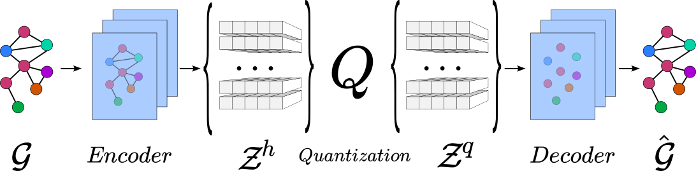

# Vector-Quantized Graph Auto-Encoder

## Welcome to the official repository of the Discrete Graph Auto-Encoder (DGAE)!

This repository contains the source code for the VQ-GAE, a powerful autoencoder for graph data that uses vector quantization to learn discrete representations. 

### Installation

Their are 4 dependencies to install. 
It is recommanded to follow this order.

1. rdkit [rdkit.org/docs/Install.html](https://www.rdkit.org/docs/Install.html) 

2. pytorch [pytorch.org/get-started/locally/](https://pytorch.org/get-started/locally/)

3. pytorch-geometric [pytorch-geometric.readthedocs.io/en/latest/install/installation.html](https://pytorch-geometric.readthedocs.io/en/latest/install/installation.html)

4. dig [https://diveintographs.readthedocs.io/en/latest/intro/installation.html](https://diveintographs.readthedocs.io/en/latest/intro/installation.html)

### Run the model

Once you have intalled the dependencies, you can run the DGAE by executing the main.py file. 

The --work_type argument allows you to specify the type of work you want to do with the DGAE (train_autoencoder, train_prior, sample). 

The --dataset argument specify the dataset, you want to use (ego, community, enzymes, qm9 or zinc).

The --model_folder, specify the folder name where the model parameters are stored. If you choose to train the prior or sample from a model, you will need to specify a folder using the --model_folder argument. This folder should contain the configuration for your model in a yaml file. ()

All the other configurations can be specify in a the yaml file as stored in the folder 'config'. 

### Checkpoints

We provide checkpoints for 3 datasets 'enzymes', 'qm9' and 'zinc':
The data should be downloaded when running the model (be aware that the preprocessed (kekulized) zinc dataset is 5.4 GB in size).

- Enzymes:
  - [Auto-encoder](https://drive.switch.ch/index.php/s/p1aXV938SZ7IlqE)
  - [Prior](https://drive.switch.ch/index.php/s/WcAGM93PWu9JRJ7)

- Qm9:
  - [Auto-encoder](https://drive.switch.ch/index.php/s/Jhv46kx3PTlXCNe)
  - [Prior](https://drive.switch.ch/index.php/s/W2k48eUUqnHGS3J)

- Zinc:
  - [Auto-encoder](https://drive.switch.ch/index.php/s/FRBeiSUJ5B2nlde)
  - [Prior](https://drive.switch.ch/index.php/s/lFAbVFlviXUCMsC)

Thank you for using the DGAE or using it as baseline. 

